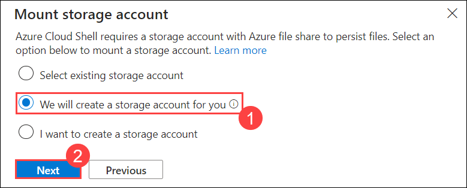

# Lab 24: Use Spark in Azure Databricks

## Lab-SCenario

Azure Databricks is a Microsoft Azure-based version of the popular open-source Databricks platform. Azure Databricks is built on Apache Spark, and offers a highly scalable solution for data engineering and analysis tasks that involve working with data in files. One of the benefits of Spark is support for a wide range of programming languages, including Java, Scala, Python, and SQL; making Spark a very flexible solution for data processing workloads including data cleansing and manipulation, statistical analysis and machine learning, and data analytics and visualization.

In this lab, you'll learn about Apache Spark clusters to process data in parallel on multiple nodes. As in many Spark environments, Databricks supports the use of notebooks to combine notes and interactive code cells that you can use to explore data.

### Objectives

After completing this lab, you will be able to:

 - Provision an Azure Databricks workspace.
 - Create a cluster.
 - Explore data using a notebook.

### Estimated timing: 45 minutes

### Architecture Diagram

   

## Tasl 1: Provision an Azure Databricks workspace

In this exercise, you'll use a script to provision a new Azure Databricks workspace.

1. In a web browser, sign into the [Azure portal](https://portal.azure.com) at `https://portal.azure.com`.

1. Use the **[\>_]** button to the right of the search bar at the top of the page to create a new Cloud Shell in the Azure portal.

    

    >**Note:** If you are not able to see the **[\>_]** button, click on the **ellipses (1)** to the right of the search bar at the top of the page and then select **Cloud Shell (2)** from the drop down options.

    

1. Selecting a ***PowerShell*** environment and creating storage if prompted. The cloud shell provides a command line interface in a pane at the bottom of the Azure portal, as shown here:

    

1. On the **Getting Started** pop-up, select the following information:-

    - Select **Mount storage account (1)**
    - Storage account subscription: **Select the existing subscription (2)**
    - Select **Apply (3)**

        

1. On the **Mount storage account** pop-up, select the following:

    - **We will create a storage account for you (1)**
    - Select **Next (2)**

        

1. Note that you can resize the cloud shell by dragging the separator bar at the top of the pane, or by using the **&#8212;**, **&#9723;**, and **X** icons at the top right of the pane to minimize, maximize, and close the pane. For more information about using the Azure Cloud Shell, see the [Azure Cloud Shell documentation](https://docs.microsoft.com/azure/cloud-shell/overview)

    
1. In the PowerShell pane, enter the following commands to clone this repo:

    ```
    rm -r dp-203 -f
    git clone https://github.com/MicrosoftLearning/dp-203-azure-data-engineer dp-203
    ```

1. After the repo has been cloned, enter the following commands to change to the folder for this lab and run the **setup.ps1** script it contains:

    ```
    cd dp-203/Allfiles/labs/24
    ./setup.ps1
    ```

1. If prompted, choose which subscription you want to use (this will only happen if you have access to multiple Azure subscriptions).

1. Wait for the script to complete - this typically takes around 5 minutes, but in some cases may take longer. While you are waiting, review the [Exploratory data analysis on Azure Databricks](https://learn.microsoft.com/azure/databricks/exploratory-data-analysis/) article in the Azure Databricks documentation.

## Task 2: Create a cluster

Azure Databricks is a distributed processing platform that uses Apache Spark *clusters* to process data in parallel on multiple nodes. Each cluster consists of a driver node to coordinate the work, and worker nodes to perform processing tasks.

> **Tip**: If you already have a cluster with a 13.3 LTS runtime version in your Azure Databricks workspace, you can use it to complete this exercise and skip this procedure.

1. In the Azure portal, browse to the **dp203-*xxxxxxx*** resource group that was created by the script (or the resource group containing your existing Azure Databricks workspace)

2. Select your Azure Databricks Service resource (named **databricks*xxxxxxx*** if you used the setup script to create it).

3. In the **Overview** page for your workspace, use the **Launch Workspace** button to open your Azure Databricks workspace in a new browser tab; signing in if prompted.

    > **Tip**: As you use the Databricks Workspace portal, various tips and notifications may be displayed. Dismiss these and follow the instructions provided to complete the tasks in this exercise.

4. View the Azure Databricks workspace portal and note that the sidebar on the left side contains icons for the various tasks you can perform.

5. Select the **(+) New** task, and then select **More > Cluster**.

6. In the **New Cluster** page, create a new cluster with the following settings:
    - **Cluster name**: Leave it as **default**
    - **Cluster mode**: Single Node
    - **Access mode** Single user (*with your user account selected*)
    - **Databricks runtime version**: 13.3 LTS (Spark 3.4.1, Scala 2.12)
    - **Use Photon Acceleration**: Selected
    - **Node type**: Standard_DS3_v2
    - **Terminate after** *30* **minutes of inactivity**
    - Select **Create Compute**

7. Wait for the cluster to be created. It may take a minute or two.

> **Note**: If your cluster fails to start, your subscription may have an insufficient quota in the region where your Azure Databricks workspace is provisioned. See [CPU core limit prevents cluster creation](https://docs.microsoft.com/azure/databricks/kb/clusters/azure-core-limit) for details. If this happens, you can try deleting your workspace and creating a new one in a different region. You can specify a region as a parameter for the setup script like this: `./setup.ps1 eastus`

## Task 3: Explore data using a notebook

As in many Spark environments, Databricks supports the use of notebooks to combine notes and interactive code cells that you can use to explore data.

1. In the Azure Databricks workspace portal for your workspace, in the sidebar on the left, select **Workspace**. Then select the **&#8962; Home** folder.

2. At the top of the page, in the **&#8942;** menu next to your user name, select **Import**. Then in the **Import** dialog box, select **URL** and import the notebook from `https://github.com/MicrosoftLearning/dp-203-azure-data-engineer/raw/master/Allfiles/labs/24/Databricks-Spark.ipynb`

3. Connect the notebook to your cluster, and follow the instructions it contains; running the cells it contains to explore data in files.

> **Congratulations** on completing the task! Now, it's time to validate it. Here are the steps:
> - Hit the Validate button for the corresponding task. If you receive a success message, you can proceed to the next task. Alternatively, you can navigate to the Lab Validation Page, from the upper right corner in the lab guide section.
> - If not, carefully read the error message and retry the step, following the instructions in the lab guide. 
> - If you need any assistance, please contact us at labs-support@spektrasystems.com. We are available 24/7 to help you out.
 
   <validation step="a7f14397-e6e9-4ba4-93ba-6821f5700621" />

## Review

In this lab, you have accomplished the following:
 - Provision an Azure Databricks workspace.
 - Create a cluster.
 - Explore data using a notebook.

## You have successfully completed the lab.
